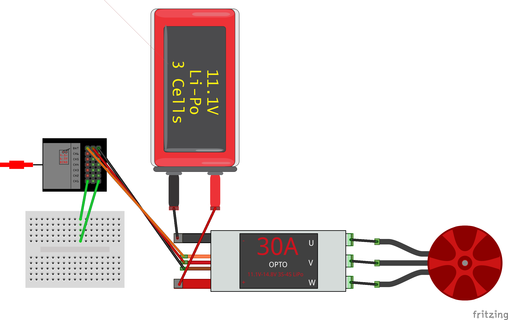
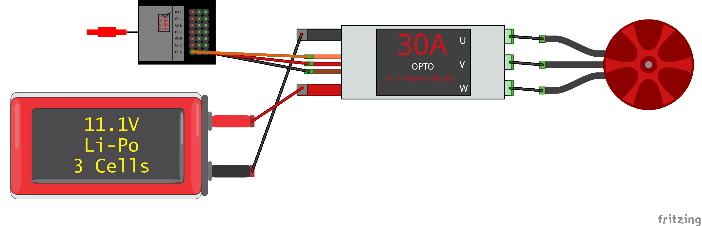

# BBBCopter

## About The Project
The goal of the project is to build a quadcopter. Of course, there are many different possibilities to chose from for both hardware and software. For this project, the goal was to get a drone that would be as affordable as possible but it should also be possible to control the drone from a computer/base station and the drone has to be programmable so that the project could later on be improved and things such as computer vision could be implemented.

### Built With
In order to fulfill the requirements of our drone listed above, we decided to use following hardware and software:
* [BeagleBone Blue](https://beagleboard.org/blue)
* [ArduPilot](https://ardupilot.org/)
* [ROS](https://www.ros.org/)

## Getting Started

In this section, the building process of the drone will be described.

### Parts List

| Part | Amount | Weight per Unit | Total Weight | Link |
|-------------------------------------|--------|-----------------|--------------|-------------------------------------------------------------------------------------------------------|
| BeagleBone Blue | 1         | 36g | 36g | [Farnell](https://ch.farnell.com/beagleboard/bbone-blue/beaglebone-blue-robotics-platform/dp/2612583) |
| F450 Frame | 1         | 278g | 278g | [AliExpress](https://de.aliexpress.com/item/4000261171695.html) |
| 2212 920KV Motor | 4                                       | 53g | 212g | [AliExpress](https://de.aliexpress.com/item/4000126748240.html) |
| 30A ESC 2-4S Lipo | 4                                       | 25g | 100g | [AliExpress](https://de.aliexpress.com/item/4000126748240.html) |
| 9450 Self-Locking Propeller | 4                                       | 22g | 88g | [AliExpress](https://de.aliexpress.com/item/4000126748240.html) |
| S603 6CH 2.4GHz PPM Receiver | 1         | 12g | 12g | [AliExpress](https://de.aliexpress.com/item/4000340190534.html) |
| NEO-M8N GPS Module | 1         | 29g | 29g | [AliExpress](https://de.aliexpress.com/item/33054561368.html) |
| 3DR 500MW 433 MHz Telemetry Module  | 1         | 45g | 45g | [AliExpress](https://de.aliexpress.com/item/4000255803909.html) |
| 3S Lipo Battery 2200mAh | 1         | 175g | 175g | [Conrad](https://www.conrad.ch/de/p/swaytronic-modellbau-akkupack-lipo-11-1-v-2200-mah-zellen-zahl-3-35-c-softcase-t-2514578.html) |

Furthermore, a transmitter will be needed to fly the drone. Make sure it is one that is compatible with the receiver. For this project, a Spektrum DX6 transmitter will be used.

### Thrust Estimation
The motor, propeller and battery combination listed above must provide enough thrust to lift the whole drone. In order to achieve this, we want a thrust/weight ratio greater than 1.5. According to experiments with similar motor/propeller/battery setup, we can expect following estimates:

| Thrust per Motor | Maximum Total Thrust | Maximum Current Draw |
|------------------|----------------------|----------------------|
| 600g | 2400g | XXA |

<br>

| Total Weight | Target T/R Ratio | Target Thrust |
|--------------|------------------|---------------|
| 910g | 1.5 | 1365g |

As we can see by comparing maximum total thrust and target thrust, our final drone should be able to lift itself into the air. Furthermore, we also must make sure that the maximum current draw can be handled by the ESC, which in our case is fine.


## Getting To Know The Individual Parts

### ESC and Motor
We can start playing around with the ESC and motor by hooking them up to an Arduino Uno or similar. The only parts we need are our Lipo battery, one ESC, one motor, the Arduino, a few jumper cables and optionally a potentiometer to control the speed of the motor.

The wiring goes as follows:


**IMPORTANT: Make sure that the BEC of the ESC outputs 5V, otherwise it might damage the Arduino.**

Depending on the ESC you have, there might be different colors for the three smaller wires in the middle:

| Color | Alternative Color | Pin |
|-------|-------------------|---------------|
| White | Orange | Signal |
| Red | Red | Positive Lead |
| Black | Brown | Negative Lead |

The code for the Arduino is pretty simple:

```C++
#include <Servo.h>

// Set pin numbers:
const int kPotentiometerPin = A0;
const int kESCPin = 9;

Servo ESC; // Create a servo object to control the ESC

void setup() {
  // Put your setup code here, to run once:
  ESC.attach(kESCPin,1000,2000); // (pin, min pulse width, max pulse width in microseconds) 
}

void loop() {
  // Put your main code here, to run repeatedly:
   int potValue = analogRead(kPotentiometerPin);   // Reads the value of the potentiometer (value between 0 and 1023)
   potValue = map(potValue, 0, 1023, 0, 180);   // Scale it for use with the servo library (value between 0 and 180, usually degrees for a servo motor -> corresponds to motor speed in this case)
   ESC.write(potValue); // Send the signal to the ESC
}
```
In case you're not using a potentiometer, just directly use `ESC.write()` with different values (0-180) to control the speed of the motor.

### ESC Calibration
ESC calibration means to set the max and min speeds of the motor with respect to the max and min width of the PWM signal sent by either the Arduino or any other device controlling the ESC. This usually has to be done the first time switching to a new setup/controller. The steps are as follows:

1. Make sure that the ESC is not connected to any power (Lipo).
2. Send the highest throttle PWM signal (e.g. turn potentiometer all the way up)
3. Plug in the battery and the ESC should now output a musical tone and two beeps indicating it is in calibration mode.
4. Lower the throttle PWM signal to full down. You should hear a couple of beeps (number of cells in your battery) and one final long beep indicating that the end points have been set and the ESC is calibrated.

### RC Receiver
In order to test the RC receiver in our setup, we first have to bind it to the transmitter. Hereafter, the process will be described for the S603 receiver (DSMX compatible) and a Spektrum DX6 trasnmitter. Other setups might include different steps.

In order to bind the Spektrum transmitter and the receiver, apart from them, we also need our Lipo battery, one esc and the bind plug that should have come with the receiver. In case no bind plug is available, two simple jumper cables and a breadboard will do as well.

In order to activate the receiver's binding mode, we have to short-circuit pin 1 and pin 3 of the BIND/DATA port (in the following diagram, we will be using channel 1 for demonstration purposes). As said before, this can either be done with the bind plug or a simple short-circuit setup.

The steps to bind the receiver to the transmitter are as follows:



1. Lower the throttle (left stick) of the transmitter to the lowest position and make sure that the transmitter is powered OFF.
2. Insert the bind plug (i.e. short-circuit pin 1 and 3) into the BIND/DATA port
3. Insert the ESC plug into the battery port or if not available, into any other free port.
4. Connect the battery to the ESC. The receiver's LED will flash rapidly when the receiver is ready to bind.
5. While pressing the BIND button, power on the transmitter.
6. Release the BIND button after the receiver's LED stays illuminated. The receiver should now be bound to the transmitter.
7. Turn off the transmitter, disconnect the battery and remove the bind plug and now you are ready to continue.

Now, we can use our transmitter and receiver setup to control the ESC and therefore the motor. Connect everything as seen in the picture below (channel 1 = THRO port, or whatever channel should control the ESC) and make sure to [calibrate the ESC](#esc-calibration) by following the steps mentioned above.


