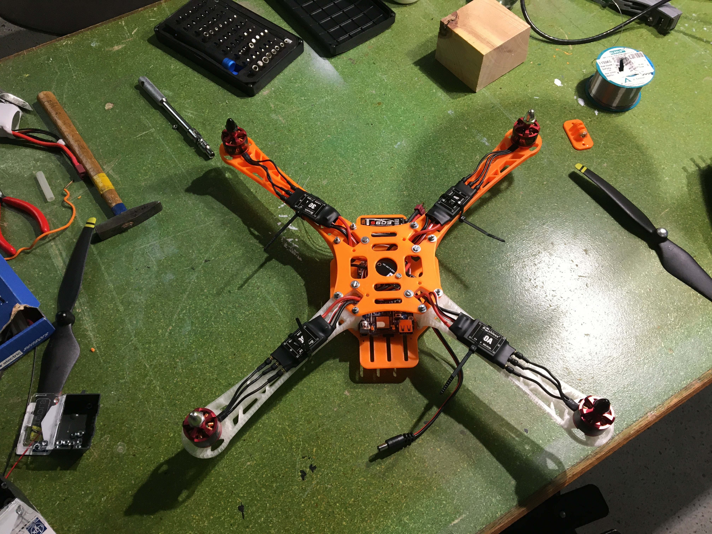
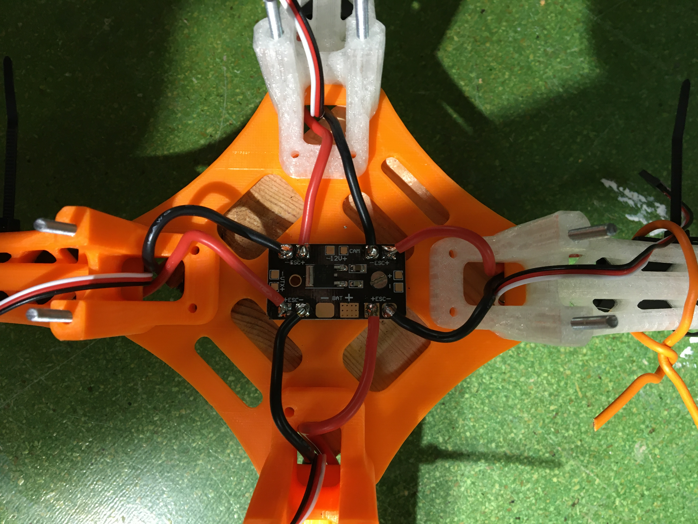
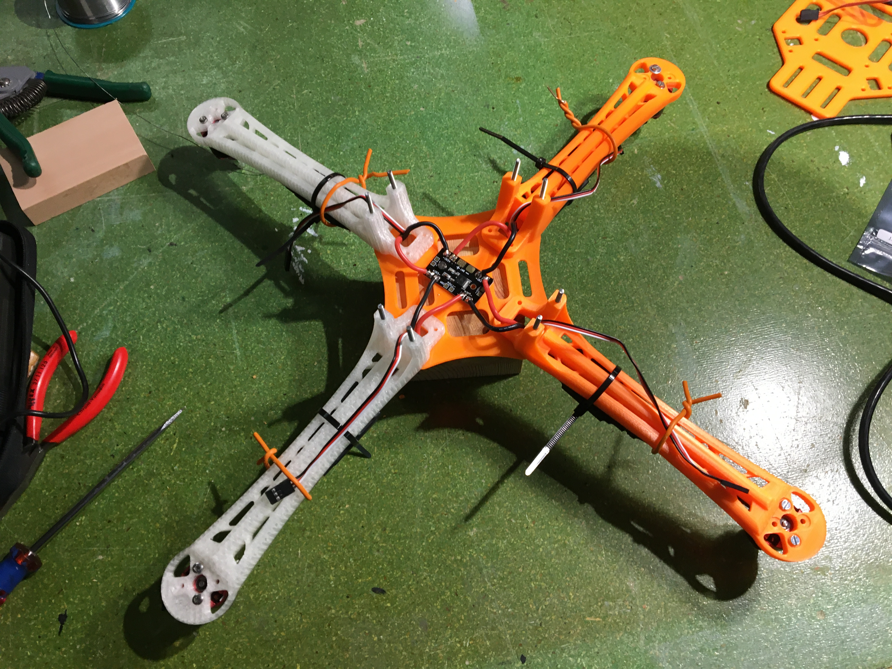
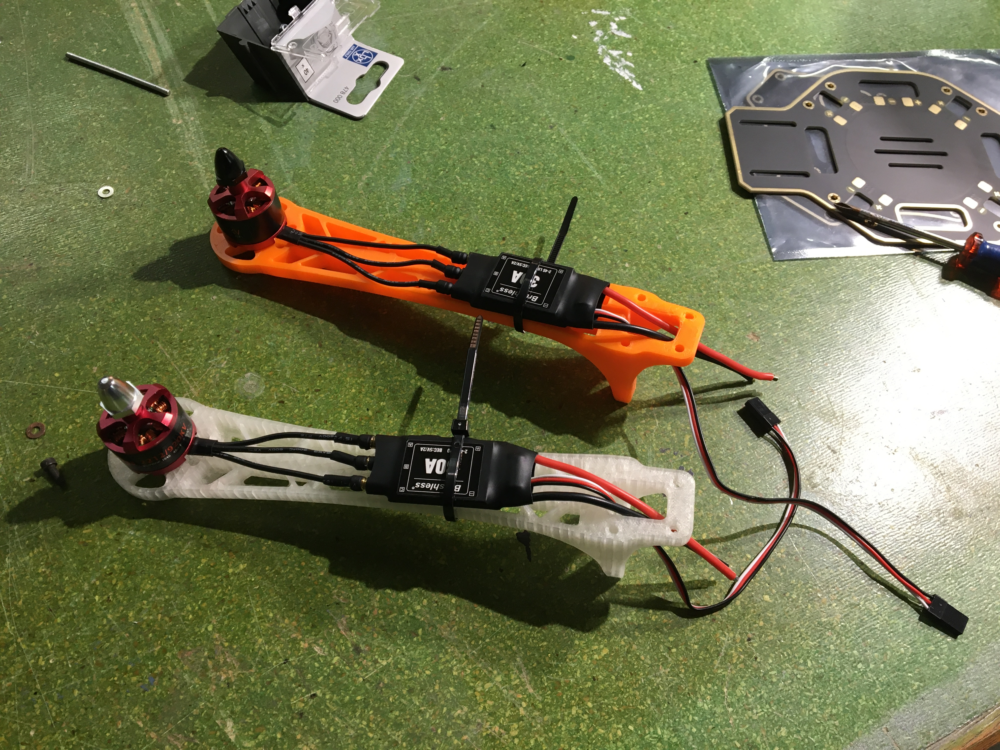

# Hardware Setup

If you have been able to acquire all the necessary parts and tools (such as solder iron), you are ready to start building the drone. Whereas most of the building does not need any explanation, here are a few important things to look out for:

1. If you have differently colored arms, chose __one color for your front two arms__ and the other color for the back. This makes it easier to detect the front of your drone when it is flying around.

2. There are two clockwise and two counter-clockwise rotating motors. These need to be aligned in the following way:

    In case you notice that one of your motor turns into the wrong direction, you might have to swap to cables that go into the ESC later on. 

3. Furthermore, also make sure to connect the ESCs of the different arms/motors to the according pin number of the servo motor outputs on your BeagleBone which will make it easier later on.

4. Solder all your ESCs to the power distributin board (directly integrated into frame). Make sure polarity is right everywhere and check for shorts. Furthermore, if you want to power the BeagleBone using your Lipo as well, you can use a DC jack cable and solder that in parallel onto the power distribution board as well. 

5. The GPS goes to the UART GPS pin (make sure to check that the wires of the GPS match the order of the BBB pins). Also it is very important that the GPS output (and also other peripherals) do not exceed __3.3V__ as it might damage the BeagleBone otherwise. In case your GPS has a built-in compass, attach that one to the I2C pin.

6. The receiver needs to be connected to the pin header at the top-right in the picture above. Connect the signal pin of the RC receiver to Signal B SBUS, the 3V3 goes to + and GND to - of the receiver (also check the main README.md for more details).

7. After powering up your drone, if your software setup is correct, ArduPilot will start automatically and you can try to connect your drone to QGroundControl or Mission Planner. Follow the steps there, to finish setting up the drone.

_Notice: This guide is subject to change and will be improved and will include a lot more details in future_

